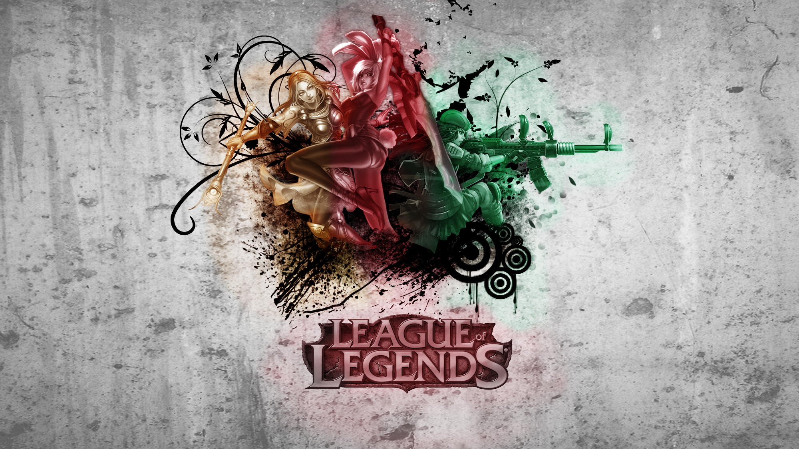
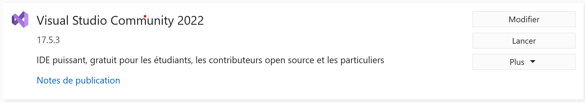
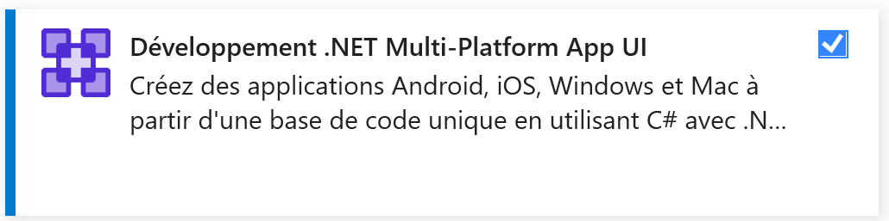
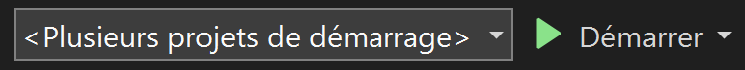

   

# **EntityFramework-API**

## Bonjour et bienvenue sur notre dépôt. ! 👋

*******

Sommaire 

 [Introduction](#introduction) | [Team](#team) | [Installer notre projet](#installation) | [Diagrams](#diagrams) | [Ameliorations](#ameliorations)
 

*******

### **Introduction au projet** :bulb:

Dans le cadre de notre formation, nous avons eu l'opportunité de développer un projet qui nous a permis de mettre en pratique les compétences acquises au fil des enseignements. Notre objectif principal était de mettre en place une API RESTful ainsi qu'une base de données en utilisant Entity Framework. Pour ce faire, nous avons exploité les avantages offerts par cette technologie pour créer une base de données dédiée à League of Legends. 

**Un peu de vocabulaire: 
Entity Framework est un outil de mappage objet-relationnel (ORM) open source développé par Microsoft. Il permet aux développeurs de faire correspondre les données stockées dans une base de données relationnelle aux objets .NET.**

*******

### **Présentation de l'équipe** :busts_in_silhouette:

Étudiants de deuxième année - BUT Informatique - IUT Clermont Auvergne - 2022-2023   
`DA COSTA CUNHA Bruno`  -  `KHEDAIR Rami` - `RANDON Noan`

*******  

## Fonctionalitées

- Installation

Pour installer notre projet sur Visual Studio, vous devez d'abord vous assurer que vous avez installé .NET Multi-Platform App UI (Maui) dans Visual Studio. Si vous ne l'avez pas encore installé, vous pouvez le faire en cliquant sur l'installeur de Visual Studio, puis en sélectionnant "Modifier".
  
Ensuite, sélectionnez "Développement .NET Multi-Platform App UI" dans la liste des fonctionnalités disponibles et installez-le.
  

Une fois que vous avez installé Maui, vous pouvez ouvrir le projet en relançant Visual Studio et en cliquant sur "Ouvrir un projet ou une solution" dans le menu Fichier. Sélectionnez le fichier de solution et cliquez sur "Ouvrir".
Pour exécuter le projet, vous devez sélectionner les projets "Api" et "Lol app" pour le démarrage. Pour ce faire, faites un clic droit sur la solution dans l'Explorateur de solutions, sélectionnez "Propriétés", puis sélectionnez "Plusieurs projets de démarrage". Enfin, sélectionnez "Api" et "Lol app" et cliquez sur "Appliquer".
   
Vous pouvez maintenant lancer le projet en appuyant sur F5 ou en cliquant sur le bouton "Démarrer" dans Visual Studio.
  

   

*******

## Diagrammes :chart_with_upwards_trend:

  

**Description des diagrammes:**
## **API**

Tout d'abord, pour le dossier ApiGlobale, on retrouve tous ce qui concerne l'Api, on a le projet Api, on l'on retrouve les différents controleurs soit le controleur RunePages, le controleur Runes, le controleur Skins et le controleur Champions. Nous avons réalisé une ApiRestFul de niveau 2, celle-ci respecte les contraintes de l'architecture REST (Representational State Transfer). Les contraintes de niveau 2 incluent l'utilisation d'URI pour identifier les ressources, l'utilisation des méthodes HTTP pour spécifier les actions à effectuer sur ces ressources (GET, POST, PUT, DELETE) et l'utilisation de messages auto-descriptifs. Nous avons donc tout naturellement mis en place de la pagination et du filtrage pour les méthode Get. Cependant on retrouve quelques méthodes que l'on a été contraints d'implanter pour s'adapter au client, ce qui ne reste pas les contraintes d'une ApiRestFul. 
Nous avons également mis en place le versionnage de code, que vous pouvez retrouver dans notre contrôleur RunePages. Nous n'avons pas étendu cette pratique à l'ensemble du projet car cela ne présentait pas d'intérêt particulier. Nous avons simplement voulu expérimenter cette fonctionnalité pour mieux comprendre son fonctionnement.
De plus nous avons utiliser swagger afin de tester notre Api. Nous voulions implémenter une Api de niveau 3, cependant la contrainte de temps nous n'a pas permis de le faire. Endin nous avons également pu déployer notre Api sur CodeFirst dans le but de la rendre accessible de n'importe ou, cela à été fait par la mise en place d'un DockerFile.
Nous avons mis en place des DTO, DTO (Data Transfer Object) est un modèle de conception qui permet de transférer des données entre des couches d'une application. 
Afin d'adapter les classes du modele à notre Api, c'est pour cela que nous avons mis en place des mapper qui permet de convertir des données d'un format à un autre, soit dans notre cas de transformer les classes du modèle en DTO avec des méthode que l'on appelé par ToDto(). Et inversement par des méthodes du genre ToSkin(), ToChampion()... 
Et pour faire cela nous avons utiliser le projet Mapper, qui permet d'effectuer ses changements, (mettre image). Afin de communiquer entre l'Api et le client nous avons utiliser le projet HTTPManager.
## **Entity Framework**

Dans Entity Framework, nous avons tout d'abord créé le "biblioMilieu", qui établit une liaison entre le modèle et notre base de données.
### **Champion**
Le champion a une relation "many-to-many" avec RunePage, une relation "one-to-many" avec Skin, ainsi qu'une relation "one-to-many" avec Skill.

### **RunePage**
Ensuite, pour mettre en place la relation entre RunePage et son dictionnaire de Catégories et Runes, nous avons créé une classe "CategoryDicDB" qui contient une Category, un Rune et un RunePage, chacun ayant une relation "one-to-many" avec les autres.

### **CharacteristicDB**
De la même manière, nous avons créé une classe "CharacteristicDB" qui contient un int et une string, ainsi qu'un Champion ayant une relation "one-to-many" avec eux.

### **Autre**
Il est important de noter que toutes les relations ont été créées en utilisant le Fluent API, ainsi qu'un grand nombre de contraintes avec les Data Annotations.
 
Pour remplir notre base de données, nous avons créé un script qui permet de transférer les données du stub vers la base de données. Vous pouvez trouver ce script dans le fichier "program.cs" du "biblioMilieu".
En fin de compte, nous avons créé notre "DbManager", qui implémente "IDataManager". Ainsi, nous disposons de toutes les requêtes vers notre base de données pour effectuer les opérations CRUD. Le but étant de pouvoir se connecter à l'API.

## **Client Maui** :handbag:
Le client Maui a été conçu pour pouvoir utiliser un "IDataManager", que ce soit celui de l'API ou d'Entity Framework. Il est important de noter qu'il faut changer le chemin d'accès si l'on souhaite lancer l'application avec Entity Framework. Pour cela, il suffit de commenter la ligne actuelle dans le fichier "EntityDbContexte" et de décommenter la ligne correspondante.

## **Tests** :zap:
Afin de garantir la qualité de notre jeu, nous avons mis en place différents tests. Nous avons tout d'abord effectué des tests unitaires pour la partie API, qui ont permis de vérifier les méthodes des contrôleurs. Par ailleurs, des tests In Memory ont été effectués pour la partie EF, afin de simuler une base de données et de vérifier son bon fonctionnement. Enfin, pour assurer la continuité de l'intégration du code, nous avons mis en place un système de CI avec Drone et Sonar sur CodeFirst. Grâce à ces outils, nous avons atteint un taux de couverture de 80%. Les tests concernant le client on été effectués par M.CHEVALDONNE.
ameliorations

## **Améliorations** :bookmark:

Il y a plusieurs améliorations possibles dans notre projet, car nous n'avons pas eu suffisamment de temps pour réaliser tout ce que nous souhaitions. Tout d'abord, nous aurions souhaité mettre en place une API RESTful de niveau 3. Malheureusement, nous n'avons pas pu implémenter toutes les méthodes de HTTP Manager dans la partie API, car nous avons privilégié d'autres fonctionnalités qui étaient plus importantes pour notre client. 

*******
